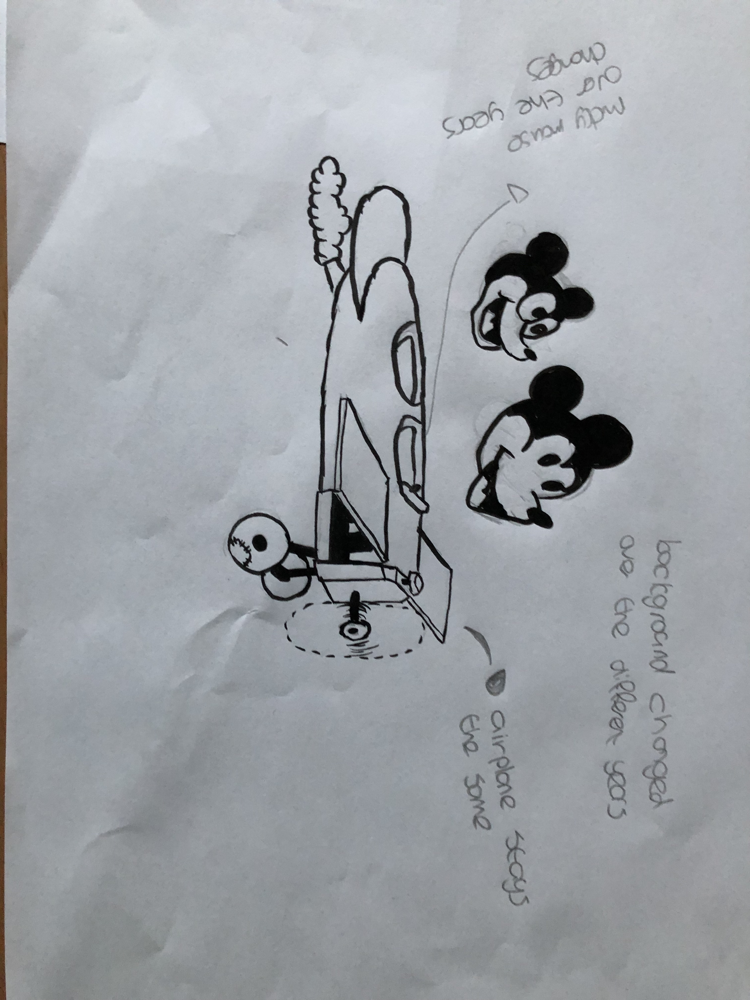

# Procesverslag
Markdown is een simpele manier om HTML te schrijven.  
Markdown cheat cheet: [Hulp bij het schrijven van Markdown](https://github.com/adam-p/markdown-here/wiki/Markdown-Cheatsheet).

Nb. De standaardstructuur en de spartaanse opmaak van de README.md zijn helemaal prima. Het gaat om de inhoud van je procesverslag. Besteedt de tijd voor pracht en praal aan je website.

Nb. Door *open* toe te voegen aan een *details* element kun je deze standaard open zetten. Fijn om dat steeds voor de relevante stuk(ken) te doen.

## Jij

### Ontwerper:
Sophia Delenardo

#### Je startniveau:
Mijn startniveau is: Blauw

# Je plan

  

  Mijn persoonlijke uitdaging voor dit project is beter worden in css animaties. Mijn streven is om daadwerkelijk een werkende animatie te
  maken in CCS.
  

  ### De eerste versie/schets:
  

  ### Je ambitie:
  Aan deze technieken/punten wil ik werken:
  - CSS animaties
  - Animatie aansturen via JavaScript

## Voortgang/Feedback 1

  
Tijdens de eerste feedback ronde had ik nog niet heel veel. Maar de feedback punten die ik had gekregen waren erg handig en heb ik bijna allemal mee genomen.

  ### Bevinding 1:
  Animaties wat duidelijk weergeven in je schetsen

  #### oplossing:
  De animatie op papier uitschetsen.

  ### Bevinding 2:
  Hoeveel jaartalen ga je laten zien in de tijdlijn? Alles is mischien een beetje veel.

  #### oplossing:
  Het limiteren van het aantal naar 3.

  ### Bevinding 3:
  Denk aan het startscherm en introductie scherm

  #### oplossing:
  Ik heb ervoor gekozen om geen start scherm te gebruiken maar gewoon een pagina.

## Voortgang/Feedback 2

  
Tijdens deze feedback liep ik nog een beetje achter. Ik had nog geen werkende animatie en geen buttons. En de button moet  ook nog gelinkt worden
  aan de animatie die ik wil toevoegen.
  

  ### Bevinding 1:
  Werkende animatie maken

  #### oplossing:
  Het daadwerkelijk maken van de animatie.

  ### Bevinding 2:
  De button maken en stijlen.

  #### oplossing:
  De button aanmaken in HTML en vervolgens in CSS stijlen.

  ### Bevinding 3:
  Button linken aan de animatie.

  #### oplossing:
  Via JavaScript de button linken. De slides bekijken en de voorbeelden.

## Reflectie

  
Mijn eindresultaat & persoonlijke ontwikkeling
  In de eerste week ben ik niet vaak op school geweest omdat ik helaas ziek was.
  Ik heb toen thuis de afbeelding van het vliegtuig gemaakt en de eerste opzet.
  In de tweede week was ik weer op school. Die maandag heb ik ook een grote sprong gemaakt in
  mijn project. Hierbij heb ik hulp gehad van Renzo. Door deze dag had ik weer veel motivatie om door te gaan.
  Dinsdag heb ik er veel aangewerkt omdat ik graag wilde dat het optijd af zou zijn. Er waren wat struggels met de animatie van het vliegtuigje
  maar na veel proberen is het reddelijk gelukt.

  

  ### Je uitkomst - karakteristiek screenshot(s):
  

  ### Dit ging goed/Heb ik geleerd:
  - Animatie aanroepen met JavaScript.
  - Meerdere animaties linken aan een button.

  

  ### Dit was lastig/Is niet gelukt:
  - Het is mij niet gelukt om meerdere mickey's toe te voegen.
  - Ik had ook graag gewild dat de jaartalen  inbeeld hadden gekomen maar dit was helaas niet gelukt.

## Bronnenlijst

continu bijhouden terwijl je werkt

Nb. Wees specifiek ('css-tricks' als bron is bijv. niet specifiek genoeg).

1. Renzo (hij heeft mij veel geholpen vooral kleine typfoutjes die ik maakte vond hij snel en hij heeft veel dingen kunnen uitleggen.)
2. Can I move an animated line from right to left? (z.d.). Stack Overflow. Geraadpleegd op 15 mei 2022, van https://stackoverflow.com/questions/37590770/can-i-move-an-animated-line-from-right-to-left
(dit was voor het vliegtuigje dat ik wilde laten bewegen van links naar rechts)
3. CSS .class Selector. (z.d.). W3schools. Geraadpleegd op 15 mei 2022, van https://www.w3schools.com/cssref/sel_class.asp
4. 77 CSS Animation Examples. (z.d.). Free Frontend. Geraadpleegd op 17 mei 2022, van https://freefrontend.com/css-animation-examples/

